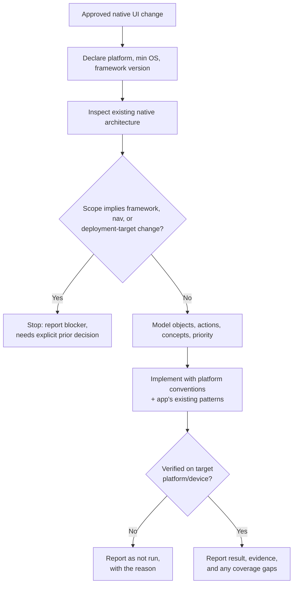

## Overview

This skill covers only implementing an already-approved native UI change in
an existing app — it does not cover deciding what the UI should be. Given
the approved change, it declares the target platform and inspects the app's
existing native architecture, models the interface's objects, actions, and
concepts before touching layout, implements using the platform's own
interaction conventions and the app's established patterns, defines state
ownership/lifetime and interruption behavior explicitly, and verifies the
result on the actual target platform rather than from code alone.

## When to use

- An approved native UI change (design, mock, spec, ticket, or a linked
  Initiative, Bug, or TODO) exists for an existing iOS, Android, desktop, or
  other native app, and the next step is building it.
- The user asks to implement a specific screen, view, or interaction in a
  native app project where the scope is already settled.

Don't use this for deciding or approving the design itself — resolve that
first. Don't use it for web or browser-only UI, which has a different
layout and platform constraint set. Don't use it for a new app with no
existing native architecture to follow. Don't use it for any change that
would require migrating framework, navigation architecture, or deployment
target without an explicit prior decision to do so.

## Prerequisites

- Read/write access to the native app repository and its build/test
  tooling, including the relevant simulator/emulator and, depending on
  risk, a physical device.
- The approved UI change itself, ideally with a design/mock reference.
- The target platform, minimum OS, and UI framework/library version. If
  it's not already obvious from the repository, declare it explicitly
  before proceeding (Procedure step 1) or treat it as a blocker if it can't
  be determined.

## Inputs

- The approved UI change or design reference.
- The target platform, minimum OS, and UI framework/library version —
  declared explicitly if not already evident from the repo.
- Any explicit constraints called out in the approval (must preserve an
  existing API or permission, must not change navigation, must ship behind
  a flag).
- Pointers to the relevant screen or module, if already known; otherwise
  located during the procedure.

## Procedure

1. Restate the approved UI change as concrete, testable behavior. Declare
   the target platform, minimum OS, and UI framework/library version from
   the repo, or explicitly if not yet evident.
2. Inspect the existing native architecture before writing anything:
   navigation pattern, state-management approach, component/view
   conventions, the API and permission contracts the screen touches, and
   existing accessibility/localization patterns.
3. Model the interface before styling it: identify the primary objects, the
   actions available on them, and the broader workflows/concepts that
   combine them; assign relative priority. Let that hierarchy drive
   navigation, prominence, grouping, and progressive disclosure. For
   substantial changes, also work through the fuller checklist
   (actors/roles/permissions, lifecycle states, what must survive
   interruption, 0/1/some/many cases) in
   [references/design-and-verification-checklist.md](references/design-and-verification-checklist.md).
4. For the platform declared in step 1, confirm the applicable convention
   against the current official platform design guidance (Apple Human
   Interface Guidelines, Google Material/Android guidance, or Microsoft
   Windows design guidance) rather than recalling it from memory —
   guidance changes over time. Use it as the default for navigation,
   controls, gestures, typography, and spacing; deviate only with a
   documented product/usability reason, verified on-platform.
   Cross-platform visual sameness alone never justifies a deviation.
5. Define ownership and lifetime of transient UI state, screen state, and
   any cached or domain data the change touches; specify what survives
   navigation, backgrounding, rotation/resizing, recreation, and relaunch.
   Handle interruption — connectivity loss, authorization expiry,
   backgrounding, cancellation/retry — without duplicate requests or false
   success.
6. Implement using the app's existing state-ownership/binding patterns,
   component system, and platform conventions, in small increments. Apply
   the object/action/concept priority from step 3 to vertical rhythm,
   typography scale, alignment, and color as authoring rules, not just a
   later check: use a deliberate platform-appropriate spacing/type scale, a
   small number of strong alignment axes, and color used semantically
   (state, hierarchy, selection) from the app's existing palette or
   platform system colors, rather than a new accent hue. Availability-gate
   any newer platform API the change relies on against the declared
   minimum OS. Do not mix units — CSS pixels, Apple points, Android dp, and
   physical pixels are not interchangeable; use the platform's own unit
   throughout. Build in accessibility (platform text scaling, semantic
   names/values, reading order, usable target sizes, contrast, reduced
   motion), localization (platform-aware dates/numbers/plurals/direction,
   longer translation lengths), and adaptive layout (rotation/folding,
   multitasking, keyboard, safe areas/insets) as part of the same change.
7. If the approved scope turns out to require a framework,
   navigation-architecture, or deployment-target change, stop and report it
   as a blocker instead of proceeding — that needs an explicit separate
   decision (see Failure behavior).

The stop/continue decision points in this procedure:



## Output

The native UI code change, limited to what the approved scope requires,
plus a report: what changed, which platform(s) were implemented and
verified, verification evidence (passed/failed/not run, including whether
checks ran on simulator/emulator vs. a physical device),
accessibility/localization/adaptive-layout coverage, and anything left out
of scope (including platforms the approval didn't cover).

## Verification

Verification must inspect the actual native interface on the target
platform rather than describe it from code alone. Check: typography/
spacing rhythm and vertical alignment; alignment axes and visual
complexity; color/contrast in all supported appearances; adaptive layouts
across window sizes/orientations; state transitions and spatial stability;
platform navigation/control conventions (back behavior, sheets, menus);
text scaling; the input methods relevant to the platform; accessibility
semantics through the actual accessibility tree/assistive technology
(VoiceOver, TalkBack, UI Automation, or screen reader — not visual
inspection alone); and representative interruption/lifecycle states
(backgrounding, rotation, low connectivity). For an Electron or other
web-rendered desktop target, run both the web checks and the desktop-shell
integration checks — neither alone is sufficient.

Separate observable violations (a clear guideline or contract break) from
subjective recommendations, and state any simulator-only, device-only, or
assistive-technology coverage gap explicitly rather than omitting it. See
[references/design-and-verification-checklist.md](references/design-and-verification-checklist.md)
for the full per-platform (iOS/SwiftUI, Android/Compose, desktop/Electron)
checklist.

## Boundaries

Stay tied to the approved UI scope only — no unrelated visual refactors or
component migrations. Preserve existing public APIs, permission contracts,
data semantics, and side effects outside the approved scope. Never migrate
framework, navigation architecture, or deployment target as part of this
skill — that requires an explicit prior decision, not an inference made
during implementation. Cross-platform visual consistency alone never
justifies overriding a native platform convention. This skill doesn't
commit, push, or open a pull request — that's governed by whatever process
invoked it. Ask rather than assume when the approved scope is ambiguous
about something affecting correctness, state ownership, or a
platform-convention deviation; for small reversible choices, state the
assumption and proceed.

## Failure behavior

If there is no approved UI change or design reference, or the target
platform/minimum OS can't be determined, stop and report that gap instead
of guessing. If a required check can't run — no simulator, no device, no
access to the platform's assistive technology — report it as "not run"
with the reason rather than skipping it silently or claiming it passed. If
the approved scope conflicts with an existing API, permission, or data
contract, or implies a framework/navigation/deployment-target change, stop
and surface the conflict instead of picking a side. Always separate
passed, failed, and not-run results, and list what's outside the delivered
scope, including any platform not verified.

## Examples

```
Add a "Notify me" toggle to the existing iOS settings screen, per the
approved design. Toggling it on should request notification permission if
not already granted.
```

Expected approach: inspect the existing settings screen's state/binding
pattern and how other toggles on that screen are wired; implement the new
toggle using that same pattern and SwiftUI's system `Toggle` control;
handle the permission-request flow using the app's existing permission
pattern rather than a new one; verify with Dynamic Type and VoiceOver on a
simulator or device.

```
Add multi-select to the existing Android contacts list, per the approved
design: long-press selects an item, a selection toolbar appears, and the
selection and scroll position must survive rotation and returning from
the backgrounded app.
```

Expected approach: inspect the existing list's state-hoisting pattern and
where scroll position is currently tracked; hoist selection state the same
way and persist both selection and scroll position across
configuration change and process death using the app's existing
`SavedStateHandle`/state-restoration pattern; verify with TalkBack, a
rotation check, and a background/foreground round-trip on an emulator or
device.
