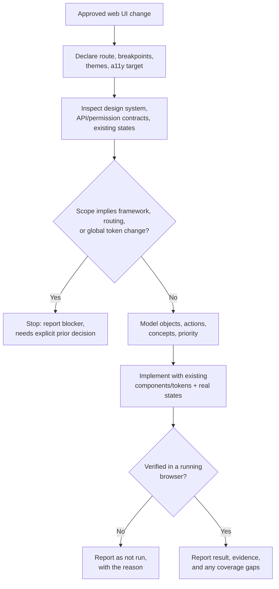

## Overview

This skill covers only implementing an already-approved web UI change in an
existing product — it does not cover deciding what the UI should be. Given
the approved change, it inspects the existing route, design system, and
API/permission contracts before touching anything; models the interface's
objects, actions, and workflows to decide layout and priority before
styling; implements using the product's existing components, tokens, and
state patterns, with real (not mocked) states and preserved input/focus;
builds in accessible, mouse-optional interaction; and verifies the result
in a running browser rather than from code or description alone.

## When to use

- An approved web UI change (design, mock, spec, ticket, or a linked
  Initiative, Bug, or TODO) exists for an existing web app or website, and
  the next step is building it.
- The user asks to implement a specific page, view, or interaction on the
  web where the scope is already settled.

Don't use this for deciding or approving the design itself — resolve that
first. Don't use it for native iOS, Android, or desktop UI, which has a
different component system and platform convention set. Don't use it for a
new site or app with no existing design system to follow. Don't use it for
any change that would require migrating framework, routing architecture, or
global design tokens without an explicit prior decision to do so. This
skill is for changes whose approved scope is the interface itself: layout,
states, interaction, or visual/structural presentation — not a behavior
change that happens to touch a web component but isn't itself about the
interface (e.g. a new query param, a validation rule, a backend
integration).

## Prerequisites

- Read/write access to the target repository, its design system/component
  library, and its test/build tooling.
- A way to run the app and inspect it in a real, rendered browser —
  ideally with browser automation (e.g. Playwright) for repeatable
  verification; a manual browser check is the floor if that isn't
  available.
- The approved UI change itself, ideally with a design/mock reference.

## Inputs

- The approved UI change or design reference.
- The route/screen it belongs to, and the supported browsers, breakpoints,
  themes, languages, and accessibility target — declared explicitly if not
  already evident from the repo or approval.
- Any explicit constraints called out in the approval (must preserve an
  existing API or permission, must not change navigation, must ship behind
  a flag).
- Pointers to the relevant page/component, if already known; otherwise
  located during the procedure.

## Procedure

1. Restate the approved change as concrete, testable behavior. Declare the
   route/screen and the supported browsers, breakpoints, themes, and
   accessibility target from the repo, or explicitly if not yet evident.
   State whether the work reproduces an approved design, refines an
   existing interface, or changes behavior.
2. Inspect before writing anything: the current route/component tree, the
   design system (tokens, component library, typography/spacing scale,
   icons), the API and permission contracts the screen touches, the
   existing state-management approach, existing tests, and how comparable
   screens in this product already handle loading/empty/error/permission
   states and terminology.
3. Model the interface before styling it: identify the primary objects,
   the actions available on them, and the broader workflows/concepts that
   combine them; assign relative priority. Let that hierarchy — not
   borders, radius, shadows, or a new accent hue — drive layout,
   prominence, grouping, navigation, and progressive disclosure. UX
   consistency with the product's existing interaction patterns, spacing,
   typography, and terminology takes precedence over local visual novelty;
   a locally prettier screen that breaks predictability is a regression.
   For substantial changes, also work through the fuller checklist
   (actors/roles/permissions, object lifecycle states, action
   frequency/consequence/reversibility, 0/1/some/many cases, state that
   must survive navigation) in
   [references/design-and-verification-checklist.md](references/design-and-verification-checklist.md).
4. If the approved scope turns out to require a framework, routing, or
   global-design-token change, stop and report it as a blocker instead of
   proceeding — that needs an explicit separate decision (see Failure
   behavior).
5. Implement using the product's existing components, tokens, and state
   patterns, in small increments, running targeted checks after each one:
   - Build every real state the change implies — pending, success,
     failure, empty, filtered-empty, validation, disabled, and
     permission-limited — with one authoritative owner for that state and
     deliberate persistence/reset behavior. Never stand in a mocked or
     placeholder state for a real one unless explicitly authorized.
   - Protect user input, focus, selection, and unsaved state through the
     change; prevent duplicate actions while a request is pending.
   - Build accessible, mouse-optional interaction: semantic controls,
     full keyboard activation, correct focus order and restoration, error
     text associated with its field, and status changes exposed to
     assistive technology, not signaled by icon/color/position alone.
   - Design for realistic content and space: narrow and wide viewports,
     long labels, larger text sizes, localization, and sparse/dense data
     — not just the design mock's exact content.
   - Preserve the existing API/permission contract; hidden UI is never a
     substitute for a real authorization check.
   - Put state in the URL only where it already belongs there.
6. Once the approved scope is covered, inspect the complete diff end to
   end and run the project's final-state checks (tests, build, type-check,
   lint) plus the browser verification in
   [Verification](#verification).

The stop/continue decision points in this procedure:



## Output

The web UI code change, limited to what the approved scope requires, plus
a report: what changed, verification evidence (passed/failed/not run,
including which browsers/breakpoints/themes were actually exercised),
accessibility coverage, and anything left out of scope. Design judgments
are reported separately from measurable violations, each with the
evidence behind it (a screenshot, a computed style, an automated-tool
result, a keyboard trace) — never asserted as satisfied without
inspecting that evidence.

## Verification

Verification must inspect the actual rendered interface in a running
browser — ideally through browser automation (e.g. Playwright) — rather
than describe it from code alone. Check:

- Vertical rhythm and type/spacing consistency, and alignment axes/visual
  seams (unnecessary extra edges, dividers, or independently aligned
  columns).
- Responsive reprioritization across the declared breakpoints, including
  realistic 0/1/some/many content cases (empty, single item, a typical
  list, a very long list/label).
- Every state the change implies (loading, success, failure, empty,
  filtered-empty, validation, disabled, permission-limited) rendered with
  real data/contracts, not just the happy path.
- Spatial stability across state transitions (no unexpected layout shift
  or lost scroll position).
- Terminology consistency with the rest of the product.
- Color and contrast in each supported theme, confirming state is never
  communicated by color alone.
- Focus order/restoration and full keyboard operability — the complete
  task reachable and completable without a mouse.
- Status changes exposed to assistive technology (not just visually), and
  errors associated with their field.

Separate observable/measurable violations (a clear guideline, contract, or
contrast/keyboard failure) from subjective design recommendations, and
state any browser, breakpoint, theme, or assistive-technology coverage gap
explicitly rather than omitting it. See
[references/design-and-verification-checklist.md](references/design-and-verification-checklist.md)
for the fuller per-concern verification checklist.

## Boundaries

Stay tied to the approved UI scope only — no unrelated visual refactor,
global design-token change, or component-library migration. Preserve
existing public APIs, permission contracts, data semantics, and side
effects outside the approved scope. Never mock or stub functionality that
should call the real API/permission contract unless the approval
explicitly authorizes it. Never claim a design principle or accessibility
requirement is satisfied without having actually inspected the evidence
for it. This skill doesn't commit, push, or open a pull request — that's
governed by whatever process invoked it. Ask rather than assume when the
approved scope is ambiguous about something affecting correctness, state
ownership, or a deviation from the existing design system; for small
reversible choices, state the assumption and proceed.

## Failure behavior

If there is no approved UI change or design reference, or the route,
design system, or supported browsers/breakpoints/accessibility target
can't be determined, stop and report that gap instead of guessing. If a
required check can't run — no way to render the app, no access to an
accessibility tool or assistive technology, no design-system reference —
report it as "not run" with the reason rather than skipping it silently or
claiming it passed. If the approved scope conflicts with an existing API,
permission, or data contract, or implies a framework/routing/global-token
change, stop and surface the conflict instead of picking a side. Always
separate passed, failed, and not-run results, and list what's outside the
delivered scope, including any browser, breakpoint, or theme not
verified.

## Examples

```
On the web project list, add a real empty state (no projects yet) and a
filtered-empty state (filters applied but no matches), per the approved
design. Both should reuse the existing illustration/message pattern from
other list pages, and the filtered-empty state needs a "Clear filters"
action.
```

Expected approach: inspect how other list pages in the product already
render empty vs. filtered-empty (component, copy pattern, illustration
tokens) and reuse that pattern rather than inventing a new one; wire the
distinction to the real query/filter state instead of a heuristic guess;
implement "Clear filters" using the existing filter-reset action; verify
both states render correctly at narrow and wide viewports, that "Clear
filters" is reachable and operable by keyboard, and that the transition
between states doesn't shift the surrounding layout.

```
Update the account settings page to show a "read-only" banner and disable
all form fields when the current user's role lacks edit permission, per
the approved spec.
```

Expected approach: inspect the actual permission check the API already
enforces for this page rather than inferring it from the UI; reuse the
product's existing disabled-field and banner/alert components and tokens;
confirm the disabled state is exposed to assistive technology (not just
visually dimmed) and that focus order skips disabled controls sensibly;
verify both the permitted and read-only cases in a running browser,
including that the API still rejects an edit attempt server-side even if a
client bypasses the disabled UI.
