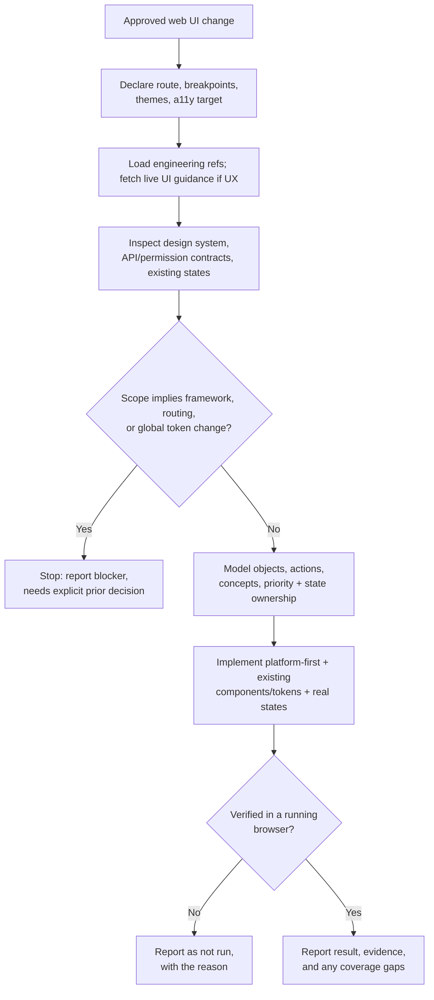

## Overview

This skill covers only implementing an already-approved web UI change in an
existing product — it does not cover deciding what the UI should be. Given
the approved change, it inspects the existing route, design system, and
API/permission contracts before touching anything; models the interface's
objects, actions, and workflows to decide layout and priority before
styling; implements with the **web platform first** (semantic HTML, modern
CSS, browser APIs) and the product's existing components, tokens, and
state patterns — loading React/Next guidance only when that is the stack —
with real (not mocked) states and preserved input/focus; builds in
accessible, mouse-optional interaction; and verifies the result in a
running browser rather than from code or description alone.

## When to use

- An approved web UI change (design, mock, spec, or a linked Initiative,
  Bug, or TODO) exists for an existing web app or website, and the next
  step is building it.
- The user asks to implement a specific page, view, or interaction on the
  web where the scope is already settled.

## Do not use when

- The design itself still needs deciding or approving — resolve that
  first.
- The UI is native iOS, Android, or desktop (including a desktop shell
  whose chrome should follow the host OS).
- There is no existing design system to follow (a greenfield site/app).
- The change would migrate framework, routing architecture, or global
  design tokens without an explicit prior decision to do so.
- The approved scope is behavior/API behind the UI (a query param, a
  validation rule, a backend integration) rather than the interface
  itself.

## Prerequisites

- Read/write access to the target repository, its design system/component
  library, and its test/build tooling.
- A way to run the app and inspect it in a real, rendered browser —
  ideally with browser automation (e.g. Playwright) for repeatable
  verification; a manual browser check is the floor if that isn't
  available.
- The approved UI change itself, ideally with a design/mock reference.

## Inputs

- The approved UI change or design reference.
- The route/screen it belongs to, and the supported browsers, breakpoints,
  themes, languages, and accessibility target — declared explicitly if not
  already evident from the repo or approval.
- Any explicit constraints called out in the approval (must preserve an
  existing API or permission, must not change navigation, must ship behind
  a flag).
- Pointers to the relevant page/component, if already known; otherwise
  located during the procedure.

## Procedure

1. Restate the approved change as concrete, testable behavior. Declare the
   route/screen and the supported browsers, breakpoints, themes, and
   accessibility target from the repo, or explicitly if not yet evident.
   State whether the work reproduces an approved design, refines an
   existing interface, or changes behavior.
2. Load the matching **engineering** references (same-skill `references/`
   only — conditional, not all at once). When making UX or visual
   decisions, fetch current public web UI guidance (the product's design
   system plus the Web Interface Guidelines / WCAG links named in the
   loaded refs) rather than inventing a visual language here:

   | Concern | Load |
   | --- | --- |
   | HTML/CSS/platform, progressive enhancement | [references/web-platform.md](references/web-platform.md) |
   | Where state lives / survives | [references/state-management.md](references/state-management.md) |
   | React / Next App Router | [references/react-and-nextjs.md](references/react-and-nextjs.md) (only if stack is React) |
   | Component APIs / composition | [references/composition-patterns.md](references/composition-patterns.md) |
   | Implementing responsive layout | [references/responsive-implementation.md](references/responsive-implementation.md) |
   | A11y implementation + verify | [references/accessibility-implementation.md](references/accessibility-implementation.md) |
   | Tests + browser loop | [references/testing-and-browser-verification.md](references/testing-and-browser-verification.md) |
   | Perf investigation / CWV | [references/performance.md](references/performance.md) |
   | Substantial modeling / full checklist | [references/design-and-verification-checklist.md](references/design-and-verification-checklist.md) |

3. Inspect before writing anything: the current route/component tree, the
   design system (tokens, component library, typography/spacing scale,
   icons), the API and permission contracts the screen touches, the
   existing state-management approach, existing tests, and how comparable
   screens in this product already handle loading/empty/error/permission
   states and terminology.
4. Model the interface before styling it: identify the primary objects,
   the actions available on them, and the broader workflows/concepts that
   combine them; assign relative priority. Let that hierarchy — not
   borders, radius, shadows, or a new accent hue — drive layout,
   prominence, grouping, navigation, and progressive disclosure. UX
   consistency with the product's existing interaction patterns, spacing,
   typography, and terminology takes precedence over local visual novelty;
   a locally prettier screen that breaks predictability is a regression.
   For substantial changes, also work through the fuller checklist in
   [references/design-and-verification-checklist.md](references/design-and-verification-checklist.md).
5. Define ownership and lifetime of transient UI state, form state, URL
   state, server/cache data, and any shared or persisted state the change
   touches ([references/state-management.md](references/state-management.md)).
   Specify what survives navigation and reload; handle interruption
   (connectivity loss, auth expiry, cancel/retry) without duplicate
   requests or false success. Prefer the smallest appropriate scope; do
   not copy server data into global client state without cause; do not
   add a state library mid-change unless approved.
6. If the approved scope turns out to require a framework, routing, or
   global-design-token change, stop and report it as a blocker instead of
   proceeding — that needs an explicit separate decision (see Failure
   behavior).
7. Implement using the product's existing components, tokens, and state
   patterns, in small increments, running targeted checks after each one.
   Prefer platform capabilities before new dependencies
   ([references/web-platform.md](references/web-platform.md)); use
   [references/react-and-nextjs.md](references/react-and-nextjs.md) only
   when the stack is React. TDD where achievable
   ([references/testing-and-browser-verification.md](references/testing-and-browser-verification.md)):
   - Build every real state the change implies — pending, success,
     failure, empty, filtered-empty, validation, disabled, and
     permission-limited — with one authoritative owner for that state and
     deliberate persistence/reset behavior. Never stand in a mocked or
     placeholder state for a real one unless explicitly authorized.
   - Protect user input, focus, selection, and unsaved state through the
     change; prevent duplicate actions while a request is pending.
   - Build accessible, mouse-optional interaction: semantic controls,
     full keyboard activation, correct focus order and restoration, error
     text associated with its field, and status changes exposed to
     assistive technology, not signaled by icon/color/position alone
     ([references/accessibility-implementation.md](references/accessibility-implementation.md)).
   - Design for realistic content and space: narrow and wide viewports,
     long labels, larger text sizes, localization, and sparse/dense data
     — implement adaptation per
     [references/responsive-implementation.md](references/responsive-implementation.md).
   - Preserve the existing API/permission contract; hidden UI is never a
     substitute for a real authorization check.
   - Put state in the URL only where it already belongs there.
8. Once the approved scope is covered, inspect the complete diff end to
   end and run the project's final-state checks (tests, build, type-check,
   lint) plus the browser verification in
   [Verification](#verification).

The stop/continue decision points in this procedure:



## Output

The web UI code change, limited to what the approved scope requires, plus
a report: what changed, verification evidence (passed/failed/not run,
including which browsers/breakpoints/themes were actually exercised),
accessibility coverage, and anything left out of scope. Design judgments
are reported separately from measurable violations, each with the
evidence behind it (a screenshot, a computed style, an automated-tool
result, a keyboard trace) — never asserted as satisfied without
inspecting that evidence.

## Verification

Verification must inspect the actual rendered interface in a running
browser — ideally through browser automation (e.g. Playwright) — rather
than describe it from code alone. For meaningful UI changes, generally:

1. Run the relevant automated tests.
2. Build / type-check / lint per the repository's existing workflow.
3. Run the application where possible.
4. Exercise the affected user flow in a real browser.
5. Check for runtime and console errors.
6. Verify keyboard / focus behavior when the change is interactive.
7. Check responsive behavior at the declared sizes.
8. Verify loading, empty, error, and other edge states the change affects.
9. Check accessibility proportionate to risk (automated + keyboard; AT
   when warranted).
10. Measure performance when performance is part of the task — fetch
    current thresholds rather than memorizing them
    ([references/performance.md](references/performance.md)).

Do **not** claim the UI is correct solely because tests or compilation
pass. Also check, as applicable:

- Vertical rhythm and type/spacing consistency, and alignment axes/visual
  seams (unnecessary extra edges, dividers, or independently aligned
  columns).
- Spatial stability across state transitions (no unexpected layout shift
  or lost scroll position).
- Terminology consistency with the rest of the product.
- Color and contrast in each supported theme; state never by color alone.
- Status changes exposed to assistive technology; errors associated with
  their field.

Separate observable/measurable violations from subjective design
recommendations, and state any browser, breakpoint, theme, or
assistive-technology coverage gap explicitly. See
[references/design-and-verification-checklist.md](references/design-and-verification-checklist.md)
and
[references/testing-and-browser-verification.md](references/testing-and-browser-verification.md).

## Boundaries

Stay tied to the approved UI scope only — no unrelated visual refactor,
global design-token change, or component-library migration. Preserve
existing public APIs, permission contracts, data semantics, and side
effects outside the approved scope. Never mock or stub functionality that
should call the real API/permission contract unless the approval
explicitly authorizes it. Never claim a design principle or accessibility
requirement is satisfied without having actually inspected the evidence
for it. Prefer standards and native browser capabilities before new
dependencies; do not prescribe Zustand, TanStack Query, or similar unless
the project already uses them. This skill doesn't commit, push, or open a
pull request — that's governed by whatever process invoked it. Ask rather
than assume when the approved scope is ambiguous about something affecting
correctness, state ownership, or a deviation from the existing design
system; for small reversible choices, state the assumption and proceed.

## Failure behavior

If there is no approved UI change or design reference, or the route,
design system, or supported browsers/breakpoints/accessibility target
can't be determined, stop and report that gap instead of guessing. If a
required check can't run — no way to render the app, no access to an
accessibility tool or assistive technology, no design-system reference —
report it as "not run" with the reason rather than skipping it silently or
claiming it passed. If the approved scope conflicts with an existing API,
permission, or data contract, or implies a framework/routing/global-token
change, stop and surface the conflict instead of picking a side. Always
separate passed, failed, and not-run results, and list what's outside the
delivered scope, including any browser, breakpoint, or theme not
verified.

## Examples

```
On the web project list, add a real empty state (no projects yet) and a
filtered-empty state (filters applied but no matches), per the approved
design. Both should reuse the existing illustration/message pattern from
other list pages, and the filtered-empty state needs a "Clear filters"
action.
```

Expected approach: inspect how other list pages in the product already
render empty vs. filtered-empty (component, copy pattern, illustration
tokens) and reuse that pattern rather than inventing a new one; wire the
distinction to the real query/filter state instead of a heuristic guess;
implement "Clear filters" using the existing filter-reset action; verify
both states render correctly at narrow and wide viewports, that "Clear
filters" is reachable and operable by keyboard, and that the transition
between states doesn't shift the surrounding layout.

```
Update the account settings page to show a "read-only" banner and disable
all form fields when the current user's role lacks edit permission, per
the approved spec.
```

Expected approach: inspect the actual permission check the API already
enforces for this page rather than inferring it from the UI; reuse the
product's existing disabled-field and banner/alert components and tokens;
confirm the disabled state is exposed to assistive technology (not just
visually dimmed) and that focus order skips disabled controls sensibly;
verify both the permitted and read-only cases in a running browser,
including that the API still rejects an edit attempt server-side even if a
client bypasses the disabled UI.
