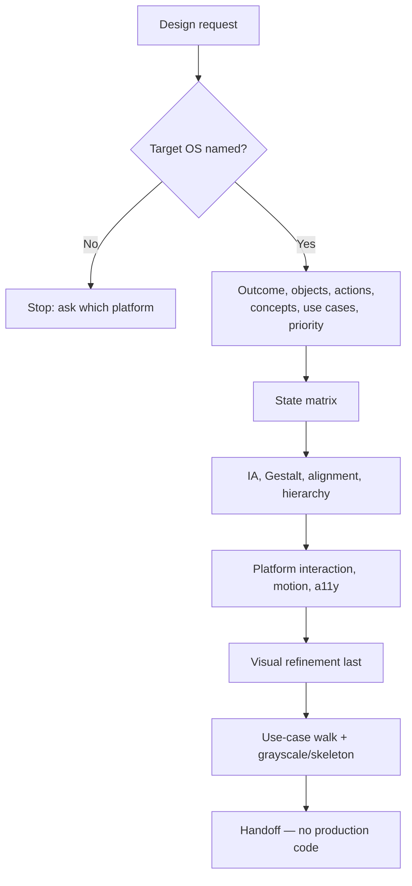

## Overview

Jumping to screens, components, or styling skips the model the interface
is supposed to render: what the user is trying to accomplish, on which
objects, with which actions, at what priority, in which states. This
skill produces **application UI design** for one named non-web platform
(mobile, tablet, desktop, or Apple Watch). It works in a fixed order —
Outcome → Objects → Actions → Concepts → Use cases → Priority →
States → Structure → Hierarchy → Interaction → Visual refinement →
Verification — then applies that OS's conventions. It returns a design
handoff an implementer (and a later review) can use. It does not write
production code, does not cover browser/web design, and does not review
a running build.

**Design vs build:** this skill answers what the experience should look
like and how it should behave. State ownership, framework APIs, tests,
and patches are later implementation work — not this procedure.

Method detail lives in `references/` and is loaded on demand. Platform
catalogs are loaded only for the target OS.

## When to use

- The ask is to **design** a screen, flow, or UI for a native or desktop
  app — "design this iOS onboarding", "propose the Android settings
  flow", "design the macOS preferences window", "design an Apple Watch
  complication + glance screen".
- The target is iOS, Android, iPad, macOS, Windows, Linux, Apple Watch /
  watchOS, or a similar non-browser surface (including an Electron or
  Flutter app whose **ship OS** is one of those).
- Someone wants platform-appropriate visual/interaction design before or
  without implementing it.

## Do not use when

- The target is a website or web app in the browser — that is web
  surface design, not app-platform design.
- The ask is only a platform-independent interaction model (actors,
  objects, actions, use cases) with no app surface or OS yet.
- The ask is to implement, restyle in code, or ship the interface.
- The ask is to review an already-built running interface for defects
  rather than produce a design.
- The platform cannot be determined and the caller cannot name one —
  see Failure behavior.

## Prerequisites

- A design brief with at least: product/flow/screen, audience or job to
  be done, and **target platform(s)**.
- Read access to existing app screens, brand, or design-system context
  when designing inside an existing product.
- Ability to fetch current official platform design guidance for the
  target OS (do not rely on remembered HIG/Material/Fluent/GNOME rules).
- No write access to the product codebase is required — this skill
  produces a handoff, not a patch.

## Inputs

- The design request and success criteria, in full.
- **Target platform** (required): iPhone/iOS, Android phone, iPad,
  macOS, Windows, Linux desktop, or Apple Watch / watchOS — or an
  explicit equivalent, including the **host/ship OS** for
  Electron/Flutter.
- Brand / design-system / reference screens if available.
- Any constraints already decided (must use system settings patterns,
  must support Dark Mode, must not add a new top-level destination).

## Procedure

1. **Fix the platform.** Name the target OS (and form factor: phone,
   tablet, desktop, wearable). For Electron/Flutter, the platform is the
   **host or ship OS**, not "Electron" or "Flutter" as a visual language.
   If more than one OS is in scope, design them as separate handoffs
   (shared product model, platform-native chrome). An iPhone + Watch
   companion is **two** handoffs
   ([references/mobile-ios.md](references/mobile-ios.md) and
   [references/wearable-apple.md](references/wearable-apple.md)). If the
   platform is ambiguous, stop (Failure behavior).
2. **Load the matching platform reference** (same-skill `references/`
   only) and fetch **current** official HIG for that OS — do not recall
   chrome from memory:
   - iOS phone → [references/mobile-ios.md](references/mobile-ios.md)
   - Android phone → [references/mobile-android.md](references/mobile-android.md)
   - iPad → [references/tablet-ipad.md](references/tablet-ipad.md)
   - Apple Watch → [references/wearable-apple.md](references/wearable-apple.md)
   - macOS → [references/desktop-mac.md](references/desktop-mac.md)
   - Windows → [references/desktop-windows.md](references/desktop-windows.md)
   - Linux desktop → [references/desktop-linux.md](references/desktop-linux.md)
3. **Inspect** existing app screens, tokens, and how the product already
   names these objects — before inventing.
4. **Model before chrome.** Load
   [references/ui-reasoning.md](references/ui-reasoning.md). Work
   Outcome → Objects → Actions → Concepts → Use cases → Priority
   (1–5). Do **not** place screens, components, cards, or styling yet.
   Prefer the user's mental model over backend names.
5. **States.** Load [references/states.md](references/states.md). Specify
   the state matrix for important objects and use cases, including
   distinct empty/filtered/error/permission cases and whether work is
   preserved.
6. **Structure.** Load
   [references/structure-hierarchy.md](references/structure-hierarchy.md).
   Derive IA from the object model; apply Gestalt, alignment audit,
   vertical rhythm, and attention budget. Map priority → hierarchy with
   the fewest signals. Prefer platform navigation patterns.
7. **Interaction.** Load
   [references/motion-feedback.md](references/motion-feedback.md) plus
   the platform reference. When the surface is input-heavy, also load
   [references/forms.md](references/forms.md). Familiarity first;
   Fitts/Hick; motion that explains change; feedback scaled to
   consequence; recovery; a11y as part of each important use case — not
   a final checklist.
8. **Visual refinement last.** Apply system controls, semantic color,
   type, and spacing from the platform reference and the app's existing
   palette. Deviate from HIG only with a documented product/usability
   reason. Cross-platform sameness is never itself a reason.
9. **Verify.** Load [references/verification.md](references/verification.md)
   and the platform verification list. Walk use cases (not screenshots);
   run grayscale and skeleton checks; confirm adaptive relationships.
   Fix the design; do not defer to implementation.
10. **Handoff and stop.** Return the output below. No production code,
    commits, or PRs.



## Output

A single self-contained **app design handoff** for the named platform, in
this order:

1. **Outcome** — what the user can accomplish, independent of UI.
2. **Model** — objects (identity, attributes, relationships, lifecycle),
   actions per object, concepts, use cases (capability form), priority
   scores (1–5) and their basis.
3. **States** — matrix for important objects/use cases, with recovery
   and whether work is preserved.
4. **Structure** — IA, grouping, alignment lines, rhythm, adaptive
   behavior per region (fixed/grow/wrap/hide/…).
5. **Interaction** — platform patterns used; motion/feedback/recovery;
   a11y intent per important use case.
6. **Visual treatment** — hierarchy mapped from priority; system
   controls; semantic color; any HIG deviation and its reason.
7. **Product context used** — screens/tokens actually inspected.
8. **Rationale** — short decisions only.
9. **Open questions** — blocking vs non-blocking.
10. **Out of scope** — including any OS not designed in this pass.

Not production code, not a component API, not a test plan. This model
is what a later review walks — not a screenshot.

## Verification

Before returning the handoff, confirm:

- The ordered model was completed before components or styling.
- Priority scores exist for important concepts/actions, or are listed
  as unknown — not silently invented.
- Distinct empty / filtered-empty / error / permission states are
  specified where reachable.
- Hierarchy matches declared priority (blur / grayscale check).
- Platform HIG was fetched, not recalled; deviations are justified.
- Use-case walk in [references/verification.md](references/verification.md)
  was applied, including object/action coverage.
- No production code, repo writes, commits, or PRs were produced.
- Facts, assumptions, decisions, and open questions stay separate.

## Boundaries

- Non-web app platforms only.
- Design and specify — do not implement in the product codebase, commit,
  push, or open a pull request.
- Follow the loaded platform reference and the product's existing
  patterns when present.
- Do not invent a second source of truth (`spec.md` / `plan.md`); this
  handoff is the contract.
- One OS (or one explicit form factor) per handoff unless the request
  named several — then separate notes per OS, not a blended chrome.
- Ask rather than assume when the platform, primary job, or a
  hard-to-reverse convention deviation is unclear; for small reversible
  choices, state the assumption and proceed.

## Failure behavior

- Platform missing or ambiguous → stop and ask which OS/form factor
  before designing.
- Goal of the request is undefined (not just the visual approach) → say
  so instead of designing an assumed product.
- Official platform guidance can't be fetched → say so and mark
  convention claims as unverified rather than inventing HIG details.
- Brand/design-system tokens conflict with a platform convention →
  surface the conflict with both options; don't silently pick a side.
- Existing app screens aren't available to inspect → state that
  limitation and design against official platform guidance plus the
  brief, naming the assumption.

## Examples

```
Design an Apple Watch complication + glance screen for today's step goal —
raise-wrist readable in two seconds; Crown scrolls detail; tap opens the
relevant goal screen.
```

Expected approach: load `references/wearable-apple.md` (not `mobile-ios`);
model outcome (see today's progress at a glance; act on the goal) and
the goal/step objects before chrome; keep the Watch slice glanceable
(priority 1 on the first screen); specify Always On redaction; return a
handoff — no code.

```
Design the iOS onboarding screens for granting notification permission —
three steps, fits Human Interface conventions, light and dark.
```

Expected approach: load `references/mobile-ios.md` and current Apple HIG;
model the permission object/action (grant, deny, skip) and first-use
state before picking a page-control; use system-aligned controls; specify
denied and skip; return a handoff — no code.

```
Design a Windows desktop preferences window for account + notifications,
consistent with the rest of our WinUI app.
```

Expected approach: load `references/desktop-windows.md` and current
Fluent guidance; match existing app chrome and Settings-style grouping;
specify narrow/snap behavior; return a handoff for implementation.

```
Design an iPhone settings flow and its companion Apple Watch glance for
the same notification preference.
```

Expected approach: two handoffs — [references/mobile-ios.md](references/mobile-ios.md)
for the phone flow and
[references/wearable-apple.md](references/wearable-apple.md) for the Watch
slice; do not shrink the iPhone UI onto the Watch.
