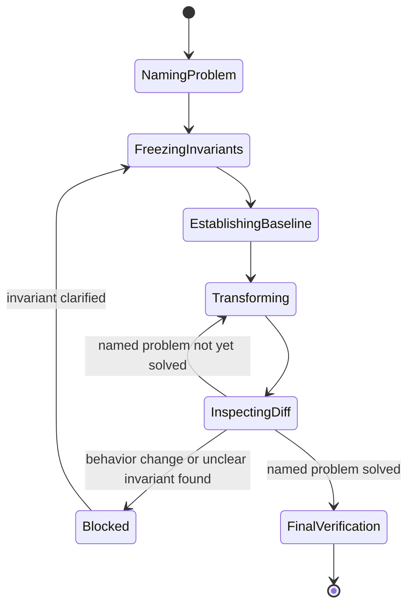

## Overview

Refactoring work drifts in two common ways: it quietly changes behavior
while looking like a cleanup, or it never stops because "while we're in
here" keeps expanding the scope. This skill is a procedure for the
narrower, more disciplined version of the task — improving how code is
structured without changing what it does. It exists separately from
general implementation work because the two need different defaults: a
feature change is judged by whether the new behavior is correct, while a
refactor is judged by whether *no* behavior changed at all. Mixing the two
in one patch makes it impossible to tell, from the diff alone, which lines
were supposed to change what.

## When to use

- The ask is to reduce duplication, split up a tangled module, extract a
  function/component, rename something for clarity, collapse dead
  abstraction, or otherwise reorganize code that already works.
- Someone says "clean this up," "this file is doing too much," "extract a
  helper for this," or "simplify this without changing what it does."
- A change is described as internal-only: no new capability, no different
  output, no different API response — just a different shape internally.

## Do not use when

- The ask adds a capability, changes an API response, fixes a bug, changes
  what a user sees or can do, or migrates a framework/dependency/runtime —
  any of these means the system's behavior is expected to change, which
  makes it approved-behavior work (in this directory, the
  `implement-feature` skill), not a refactor.
- The ask starts as "just cleanup" but, once inspected, actually depends on
  changing a return value, a side effect, or a public interface to work —
  stop and hand it off rather than finishing it under this skill's looser
  bug-fixing assumptions (see Failure behavior).
- The ask is "make this faster" — that's a performance change, judged by a
  benchmark, not a structural one judged by behavior preservation. It may
  use similar mechanics but has a different success criterion and belongs
  elsewhere.
- No specific structural problem is named — "make the code better" or "add
  more abstraction" is not a scoped refactor; ask what maintenance problem
  it's meant to solve first.

## Prerequisites

- Read/write access to the target code and whatever test/build tooling the
  project already uses to check it.
- A named structural problem in the code that's in scope (see Inputs). If
  none exists yet, treat that as a blocker per
  [Failure behavior](#failure-behavior) rather than inventing one to
  justify a change.

## Inputs

- The specific maintenance problem to solve — e.g. "this logic is
  duplicated in three call sites," "this module imports from a layer it
  shouldn't," "this function does five unrelated things," "this
  abstraction has one caller and adds a layer of indirection with no
  payoff." A goal stated only as fewer lines, fewer files, or more
  abstraction is not specific enough to start from.
- Any invariants already known to matter (a public API a caller depends
  on, a data format another system reads) — if none are supplied, they get
  derived during the procedure rather than skipped.
- Explicit exclusions: code, files, or behavior that's off-limits for this
  pass even if related.
- Pointers to the code in scope, if already known; otherwise locate it
  during the procedure.

## Procedure

1. **Name the problem** — state the concrete structural issue being
   solved, specific enough that it's obvious when it's fixed. Reject
   "fewer lines" or "more abstraction" as the actual target; ask what
   maintenance pain the current structure causes.
2. **Freeze the invariants** — before touching any code, enumerate what
   must not change, by class: public interfaces (signatures, exports,
   routes, CLI flags), return values and error behavior, side effects
   (writes, network calls, logging, emitted events), ordering guarantees,
   persisted/stored-data shape, permissions and access checks, timing
   guarantees (timeouts, debounce, rate limits), user-visible and
   accessibility behavior (focus, selection, screen-reader text, keyboard
   paths), and external contracts (API responses, schemas, wire formats
   other systems depend on). Skip a class only if it plainly doesn't apply
   to the code in scope, not by default.
3. **Establish the baseline** — inspect the code's callers, its existing
   tests, its current output, and any recorded design decisions for the
   area in scope. For any invariant from step 2 that no existing test
   actually protects, add a characterization test for it before changing
   anything, so a later regression has something to fail against. If this
   inspection surfaces something that looks like a bug rather than an
   intended contract, record it and leave it alone — see step 6.
4. **Transform in the smallest reviewable step** — make one small,
   self-contained structural move (a rename, an extraction, an inline, a
   file move) rather than batching several into one pass. Prefer a
   mechanical refactoring tool for the move when the language/editor/IDE
   has one, since a tool cannot silently retype behavior the way a
   freehand rewrite can. Leave formatting-only changes, dependency bumps,
   and anything not required by the named problem out of this step.
5. **Inspect the diff for this step** — read the actual diff, including
   the full text of every changed or deleted test, not just whether the
   suite is green. Look specifically for deleted test cases, relaxed
   assertions, changed snapshots, and altered mocks/fixtures — each of
   these can hide a behavior change behind a passing run. If the step
   turns out to require a real behavior change to work, or an invariant
   from step 2 turns out to be unclear, stop the loop and resolve it
   before continuing (see the `Blocked` branch below) rather than pushing
   through.
6. **Repeat only while the named problem remains** — once step 1's problem
   is resolved, stop looping, even if adjacent code still looks
   improvable. Anything else noticed along the way — a bug, a missing
   feature, a dependency that should be upgraded — gets recorded as a
   separate, out-of-scope item, never folded into this patch.
7. **Final verification** — once the loop exits, verify the whole change
   together (not just the last step) per [Verification](#verification).

The loop stays inside transforming and inspecting while the named problem
remains, with an explicit blocked branch for anything that turns out to
need a behavior change or an invariant clarification — it does not resolve
that branch by proceeding past it:



`Blocked` resolves only by clarifying the invariant or by exiting into
[Failure behavior](#failure-behavior) — never by continuing the
transformation on top of an unresolved gap.

## Output

The patch, limited to the named structural problem, plus a report with:

- What became simpler and why, tied back to the named problem.
- The invariants that were checked (per step 2) and how each was verified.
- Verification evidence — passed / failed / not run — not just a claim
  that it works.
- A separate list of anything discovered but deliberately excluded: bugs,
  missing features, migrations, or performance issues, each named
  specifically enough that a follow-up task could pick it up.

## Verification

- Exercise the code through the same stable boundary used for the
  baseline in step 3 (the public API, CLI, or UI entry point) — not
  through internal calls the refactor itself may have moved — covering
  the ordinary case plus the boundary and failure cases implied by the
  frozen invariants.
- Read the full diff of every changed or deleted test across the whole
  change, not only within each step: confirm no test was deleted,
  weakened, or given a relaxed assertion/snapshot/mock to make the change
  pass instead of the code meeting the original bar.
- Confirm the complete effect of the change, not just the last individual
  step: check callers, any generated or config output touched, and, for
  UI code, focus/selection/input/navigation/accessibility and async
  ordering.
- Confirm every invariant enumerated in step 2 was actually exercised by
  some check — not assumed safe because nothing failed.

## Boundaries

- No commits, pushes, pull requests, or other publishing actions — that's
  governed by whatever process invoked this skill.
- No bug fixes, feature additions, dependency/framework migrations, or
  performance work folded into the same patch, even when the fix looks
  trivial — record them as discovered-but-excluded instead.
- Never weaken, delete, or loosen a test to make a step pass. A test that
  fails only because it referenced an internal name/path that the move
  itself relocated (not because an invariant broke) may be updated to
  follow the move — but read that diff with the same scrutiny as any other
  test change before accepting it.
- No scope creep once the named problem is solved — do not keep refactoring
  adjacent code, chase a lower line count, or add abstraction "while
  already in there."
- When an invariant or the scope itself is ambiguous in a way that affects
  correctness or is hard to reverse, raise it rather than assume; for a
  small, reversible judgment call, state the assumption and proceed.

## Failure behavior

- No named structural problem exists, or the request only maps to "make
  it better" — stop and ask what maintenance problem the change is meant
  to solve, rather than inventing one.
- No accessible baseline (no way to run the existing tests/build, or the
  code has no test coverage and none can be added) — stop and report the
  gap rather than moving code with no way to verify it stayed equivalent.
- A step turns out to require an actual behavior change to work, or an
  invariant conflicts with what the code is asked to do — stop, report the
  specific conflict, and hand it off as approved-behavior work (in this
  directory, the `implement-feature` skill) rather than continuing under
  this skill's behavior-preserving assumptions.
- A required verification step (test run, build, type-check) can't be
  run — report it as "not run" with the reason instead of skipping it
  silently or assuming it would pass.
- Always separate passed, failed, and not-run verification results, and
  list discovered-but-excluded items separately from what was actually
  changed.

## Examples

```
This file has the same validation logic copy-pasted across four handler
functions. Extract it into one shared helper without changing what any
handler returns.
```

Expected approach: name the problem (validation duplicated across four
handlers), freeze invariants (each handler's current return value and
error response for valid/invalid input), confirm or add tests covering
each handler's current validation behavior, extract one shared helper and
switch handlers to it one at a time, inspect each step's diff including
any test changes, then run the full handler test suite and confirm all
four still return exactly what they did before reporting the change as
done.

```
This module reaches directly into another module's internals instead of
going through its public interface. Fix the dependency without changing
any of its outputs.
```

Expected approach: name the problem (the module bypasses the other
module's public interface), freeze invariants (every value and side effect
currently produced through the internal reach-in), check whether existing
tests cover those call sites and add characterization tests where they
don't, redirect the calls through the public interface in small steps,
inspect the diff and full test-diff after each step, and verify the
consuming code's outputs are byte-for-byte the same as the baseline before
reporting.
