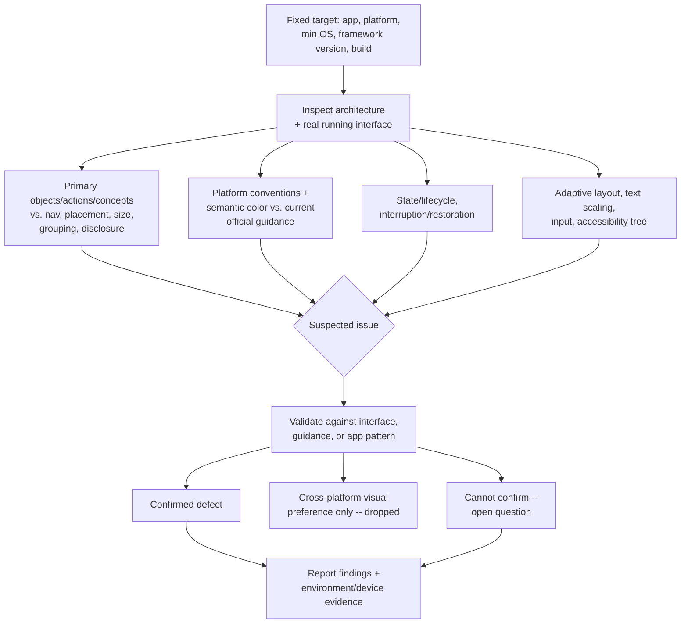

## Overview

Native UI review drifts toward opinions about visual style unless it's
anchored to something checkable: the platform's own interaction
conventions, the app's actual state/lifecycle behavior, and the real
accessibility tree — not a code read-through or a screenshot. This skill is
a fixed procedure for reviewing one concrete native interface — a built
screen, flow, or release candidate on a named app/platform/version — for
platform-convention violations, state/lifecycle defects, accessibility
gaps, layout problems, and interaction issues. It inspects the real running
interface wherever possible, checks it against current official platform
guidance and the app's existing patterns, validates every suspected issue
before it counts as a finding, and separates confirmed defects from
subjective cross-platform visual preferences. It reviews and reports; it
does not edit the interface under review.

## When to use

- The user asks to review a native screen, flow, or build — "review this
  iOS screen before release", "check this Android flow for accessibility
  issues", "does this desktop dialog follow platform conventions", "audit
  this native interface for lifecycle bugs".
- A built native interface needs checking against platform HIG/Material/
  Windows conventions, the app's own established patterns, or its
  state/lifecycle and accessibility behavior — not just a general visual
  pass.
- Someone wants a second look at how an interface handles interruption,
  restoration, permissions, adaptive layout, or assistive technology before
  it ships.

## Do not use when

- The request is to also fix what's found, not just review — finish the
  review first, then invoke a native implementation skill as a separate,
  explicitly authorized step. Don't blend review and modification into one
  pass.
- Nothing has been built yet and the ask is to decide or approve a new
  design — that's design/product work, not review of an existing interface.
- The UI is web or browser-only with no native shell to inspect — this
  skill's platform-convention and accessibility-tree checks are
  native-specific.
- The exact app, platform, and version under review can't be pinned down
  (see Failure behavior) — resolve that first rather than reviewing a
  moving or undefined target.
- The ask is only to check a finished implementation against its stated
  acceptance criteria (pass/fail against a spec), with no native
  platform-convention, state/lifecycle, or accessibility-tree dimension in
  scope — that's `verify-implementation`, not this skill.
- The ask is a general source-diff or code-quality review (correctness,
  reuse, maintainability) with no request to inspect the running native
  interface itself — that's `review-code`, not this skill.

## Prerequisites

A fixed review target is required input, not something this skill infers:
the app, the target platform (iOS, Android, desktop, or other), the
minimum OS and UI framework/library version, and the specific
screen/flow/build under review. Access to the real interface — a
simulator/emulator at minimum, a physical device where risk warrants it —
and, where available, the app's source for inspecting architecture and
existing patterns. Access to the platform's assistive technology
(VoiceOver, TalkBack, UI Automation, or equivalent screen reader) for the
accessibility checks; if unavailable, that's a named coverage gap, not a
reason to skip the review.

## Inputs

- The exact app, platform, minimum OS, and UI framework/library version,
  and the specific screen/flow/build under review.
- Any original requirements, design/mock reference, or acceptance criteria
  the interface is supposed to satisfy, plus known invariants (must
  preserve an existing permission contract, must match an established
  pattern elsewhere in the app).
- Access to the running interface (simulator/emulator or device) and,
  where available, the source repository.
- Access to the platform's assistive technology, if accessibility findings
  are in scope.

## Procedure

1. **Fix the target** — resolve and state the exact app, platform, minimum
   OS, UI framework/library version, and the specific screen/flow/build
   under review before inspecting anything. Confirm it isn't still moving.
2. **Inspect architecture and the real interface** — read the existing
   native architecture (navigation pattern, state-management approach,
   existing accessibility/localization patterns) for context, then inspect
   the actual running interface on a simulator/emulator or device. Don't
   review from code or screenshots alone when the real interface is
   reachable.
3. **Review object/action/concept priority** — before checking
   convention-by-convention, identify the interface's primary objects,
   actions, and workflows/concepts, and the relative priority they should
   carry. Check whether navigation, placement, size, grouping, and
   progressive disclosure actually communicate that priority — this is
   more important than surface-styling review, not a subset of it. A
   secondary action rendered as the most visually prominent control, or a
   primary object's state buried behind progressive disclosure with no
   documented product/usability reason, is a finding, independent of
   whether individual controls match platform styling.
4. **Review platform conventions** — check navigation, controls, gestures,
   menus, dialogs, typography, and spacing against the current official
   platform guidance for the target OS (Apple Human Interface Guidelines,
   Google Material/Android guidance, or Microsoft Windows design guidance),
   not recalled from memory. A deviation with no documented product/
   usability reason is a finding; matching another platform's look is
   never itself a justification for a native deviation, and differing from
   another platform's look is never itself a defect (see step 10). Include
   a semantic-color check as its own explicit item, separate from the
   accessibility-contrast check in step 9: color used to signal state,
   hierarchy, selection, or available actions must be applied consistently
   and match the platform's semantic-color conventions, not just used
   decoratively or inconsistently — this is a meaning check, not a
   contrast/legibility check.
5. **Review state ownership/lifetime and interruption/restoration** — what
   survives navigation, backgrounding, rotation/resizing, recreation, and
   relaunch; how the interface behaves through connectivity loss,
   authorization expiry/denial, cancellation/retry, and return-to-app.
   Flag duplicate requests or false success on uncertain outcomes.
6. **Review permissions** — requested in context at point of use, and
   handled gracefully when denied or revoked, matching the app's existing
   permission pattern.
7. **Review adaptive layout** — available window sizes, orientation/
   folding, multitasking, keyboard, safe areas/insets, and spatial
   stability during transitions.
8. **Review text scaling and localization** — platform text-scaling
   behavior (Dynamic Type, font scale) at larger sizes, and
   platform-aware dates/numbers/plurals/direction/longer-translation
   handling.
9. **Review input and accessibility** — the input methods relevant to the
   platform (touch, keyboard, precision pointer) and actual accessibility
   semantics through the real accessibility tree/assistive technology
   (VoiceOver, TalkBack, UI Automation) — not visual inspection alone:
   labels/traits, reading order, usable target sizes, contrast, reduced
   motion.
10. **Validate and separate findings** — before any suspected issue counts
    as a finding, check it against the real interface, platform guidance,
    the app's own patterns, or another appropriate source. Explicitly
    separate observable violations (a documented convention or contract
    break, or a mismatch between the interface's primary objects/actions/
    concepts and the priority its navigation/placement/size/grouping/
    disclosure or semantic color actually communicates) from subjective
    cross-platform visual preferences — the latter are not findings unless
    tied to a concrete usability or accessibility problem.
11. **Report environment evidence** — record what was actually checked:
    device/OS/window used, simulator vs. physical device, and any
    simulator-only limitation (e.g. some permission flows, haptics, or
    assistive-technology behavior don't fully reproduce off-device).
12. **Rank and structure findings** — prioritize by real impact,
    consolidate duplicates, and split into confirmed defects, open
    questions, and optional improvements before returning them.



See
[references/platform-review-checklist.md](references/platform-review-checklist.md)
for the fuller per-platform (iOS/SwiftUI, Android/Compose, desktop/Electron)
verification checklist and detail on separating defects from preferences.

## Output

Return findings grouped in this order, each group visibly separate:

1. **Confirmed defects** — validated issues, most-impactful first.
2. **Open questions** — suspected issues that couldn't be confirmed or
   denied with available evidence.
3. **Optional improvements** — real but non-blocking suggestions, kept
   distinct from subjective cross-platform visual preferences (which are
   not reported as findings at all unless tied to a concrete usability or
   accessibility problem).

Each finding includes:

- **Severity/priority**
- **Location** — precise: screen/component/state, or file/line if sourced
  from code
- **Failure scenario** — concrete: what input, state, device, or
  assistive-technology interaction causes it to go wrong
- **Impact**
- **Evidence** — what was actually observed on the real interface, or the
  specific platform-guidance passage being violated
- **Suggested correction** — the smallest supported fix or decision,
  described only; this skill does not apply it
- **Confidence/condition** — when an assumption remains

Close with an **environment/evidence** summary: app/platform/OS/device or
simulator used, which checks ran on a physical device vs. simulator/
emulator, and any coverage gap (no device, no assistive-technology access,
a check that couldn't run) stated explicitly rather than omitted.

## Verification

Before handing back findings, check:

- The target (app, platform, minimum OS, framework version, specific
  build) was fixed and stated, not left implicit.
- The real interface was inspected, not just code or a screenshot, wherever
  it was reachable.
- Platform conventions were checked against current official guidance, not
  recalled from memory.
- The interface's primary objects, actions, and concepts were identified,
  and navigation, placement, size, grouping, and progressive disclosure
  were checked against the priority those objects/actions/concepts should
  carry — not assumed to be right because individual conventions passed.
- Color used for state, hierarchy, selection, or action was checked for
  semantic consistency, as a distinct check from accessibility contrast.
- State/lifecycle, interruption/restoration, permissions, adaptive layout,
  text scaling/localization, input, and accessibility-tree behavior were
  each considered, not only visual layout.
- Every confirmed defect was validated against the real interface,
  platform guidance, or the app's own pattern — not left as an unvalidated
  suspicion.
- Confirmed defects are separated from subjective cross-platform visual
  preferences, and both are separated from open questions and optional
  improvements.
- Environment/device evidence and any simulator-only or
  assistive-technology coverage gap are stated explicitly.
- No UI or code was edited during the review.
- No secrets or sensitive material encountered during review were
  reproduced in the output.

## Boundaries

This skill reviews and reports; it does not edit the interface under
review and does not apply any of its own suggested corrections, unless a
human or the invoking task explicitly authorizes a separate edit step. The
natural next step — a native implementation/fix skill — is a follow-on the
caller can invoke separately, not a hard dependency; this skill works
standalone. Cross-platform visual consistency alone is never sufficient
grounds for a finding in either direction: it doesn't excuse a native
convention violation, and it isn't itself a defect. Keep review and
modification separate unless both are explicitly requested together.

## Failure behavior

- No fixed app/platform/version/build, or the target keeps moving → stop
  and ask rather than reviewing a moving target.
- The real interface isn't reachable (no simulator, no device, no build) →
  say so and state which checks had to fall back to code/screenshot review
  instead of silently treating that as equivalent.
- The platform's assistive technology isn't accessible → report
  accessibility-tree checks as "not run" with the reason, not skipped
  silently or claimed as passed.
- A suspected defect can't be validated with available evidence or access
  → report it as an open question, not a confirmed defect.
- A suspected issue turns out to be only a cross-platform visual
  preference with no concrete usability or accessibility impact → drop it,
  don't report it as a defect or optional improvement.
- Secrets or sensitive material are encountered while reviewing → don't
  reproduce them in the findings output; reference their location only.
- Always separate passed, failed, and not-run checks, and list what's
  outside the reviewed scope, including any platform or device class not
  covered.

## Examples

```
Review the iOS "Order details" screen on the current App Store build
before we ship an update to it. iOS 17+, SwiftUI.
```

Expected approach: fix the target (iOS 17+, SwiftUI, current App Store
build, "Order details" screen); inspect the real screen on a simulator or
device rather than just the source; check its navigation/presentation
against current Apple HIG, its state ownership/lifetime across
backgrounding and rotation, Dynamic Type behavior, and VoiceOver labels/
reading order; validate any suspected issue against the running interface
or HIG before reporting it; separate a confirmed defect (e.g. a control
missing a VoiceOver label) from a subjective preference (e.g. "I'd make
this button bigger" with no usability basis); report confirmed defects,
open questions, and optional improvements with environment evidence (
simulator vs. device, iOS version used).

```
Check the Android task-list multi-select flow for accessibility and
lifecycle issues. It should survive rotation and returning from a
backgrounded app.
```

Expected approach: fix the target (Android, the task-list screen, the
multi-select flow, stated min OS); inspect the real running flow on an
emulator or device; verify selection state and scroll position actually
survive rotation and a background/foreground round-trip; verify TalkBack
can reach and describe the selection toolbar and touch targets meet the
platform minimum; validate each suspected issue against the running app
before reporting it; state explicitly if TalkBack access wasn't available
for part of the check rather than omitting that gap.
