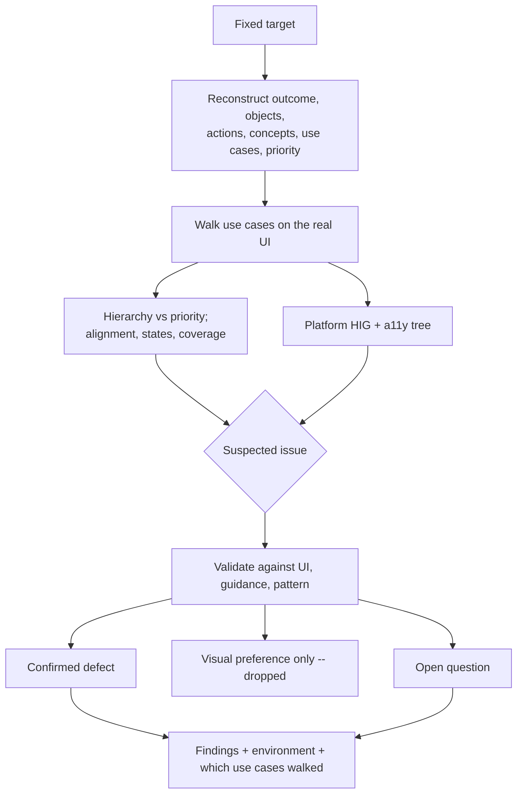

## Overview

Native UI review drifts toward opinions about visual style unless it's
anchored to the same model used to design the surface: outcome, objects,
actions, concepts, use cases, and priority — then platform conventions,
lifecycle, and the real accessibility tree. This skill is a fixed
procedure for reviewing one concrete native interface — a built screen,
flow, or release candidate on a named app/platform/version. It
**reconstructs** that model from evidence, walks important use cases on
the running interface, then checks HIG/Material/Fluent/GNOME conventions
and a11y. It does not start from whether a screenshot looks good. **Less
is more:** actively look for controls, containers, chrome, visual levels,
words, or decorative elements that could be removed, combined, or hidden
behind progressive disclosure without losing anything the use case
needs. It reviews and reports; it does not edit the interface.

## When to use

- The user asks to review a native screen, flow, or build — "review this
  iOS screen before release", "check this Android flow for accessibility
  issues", "does this desktop dialog follow platform conventions", "audit
  this native interface for lifecycle bugs".
- A built native interface needs checking against platform HIG/Material/
  Windows conventions, the app's own established patterns, or its
  state/lifecycle and accessibility behavior — not just a general visual
  pass.
- Someone wants a second look at how an interface handles interruption,
  restoration, permissions, adaptive layout, or assistive technology before
  it ships.

## Do not use when

- The request is to also fix what's found — finish the review first, then
  invoke a native implementation skill as a separate, explicitly
  authorized step. Don't blend review and modification into one pass.
- Nothing has been built yet and the ask is to decide or approve a new
  design — that's design/product work, not review of an existing interface.
- The UI is web or browser-only with no native shell to inspect.
- The ask is only pass/fail against stated acceptance criteria with no
  native platform-convention, state/lifecycle, or accessibility-tree
  dimension in scope, or is a general source-diff/code-quality review with
  no request to inspect the running interface itself.

## Prerequisites and inputs

- A fixed review target, not something this skill infers: the app, target
  platform (iOS, Android, desktop, or other), minimum OS and UI
  framework/library version, and the specific screen/flow/build under
  review.
- Any original requirements, design/mock reference, or acceptance criteria
  the interface should satisfy, plus known invariants (must preserve an
  existing permission contract, must match an established pattern
  elsewhere in the app).
- Access to the real interface — a simulator/emulator at minimum, a
  physical device where risk warrants it — and, where available, the
  app's source for inspecting architecture and existing patterns.
- Access to the platform's assistive technology (VoiceOver, TalkBack, UI
  Automation, or equivalent) for the accessibility checks; if unavailable,
  that's a named coverage gap, not a reason to skip the review.

## Procedure

1. **Fix the target** — exact app, platform, minimum OS, UI framework/
   library version, and screen/flow/build. Confirm it isn't still moving.
2. **Reconstruct the model** — load
   [references/ui-reasoning.md](references/ui-reasoning.md). From the
   design handoff, requirements, or the running UI, establish Outcome →
   Objects → Actions → Concepts → Use cases → Priority (1–5). Do not
   invent priorities. Do not start from components or styling.
3. **Inspect the real interface** — architecture for context, then the
   running UI on simulator/emulator or device. Don't review from code or
   screenshots alone when the real interface is reachable.
4. **Walk use cases** — load
   [references/verification.md](references/verification.md). For each
   important use case run the twelve questions (discover, primary path,
   context, decisions, feedback, recovery, states, hierarchy vs priority,
   platform convention, a11y, extreme content, adaptive layout). A
   beautiful screen that fails a use case is a failed design.
5. **Coverage and states** — load [references/states.md](references/states.md).
   Object/action audit; distinct empty vs filtered-empty vs error vs
   permission; work preserved; interruption/restoration.
6. **Structure vs priority** — load
   [references/structure-hierarchy.md](references/structure-hierarchy.md).
   Alignment audit, rhythm, Gestalt grouping, attention budget, grayscale
   and skeleton checks. A secondary action as the most prominent control
   is a finding even if every widget is HIG-correct.
7. **Platform conventions** — current official HIG for the target OS
   (not memory). Semantic color as meaning, separate from contrast.
   Cross-platform sameness is never a defect or an excuse. Load
   [references/platform-review-checklist.md](references/platform-review-checklist.md)
   for per-platform items.
8. **Permissions, adaptive layout, text scaling, input, a11y tree** —
   as in the platform checklist: point-of-use permissions; size classes /
   insets; Dynamic Type / font scale; VoiceOver / TalkBack / UI Automation
   — not visual inspection alone. Load
   [references/motion-feedback.md](references/motion-feedback.md) when
   motion, feedback, or recovery is in question.
9. **Validate and separate** — a suspected issue is a finding only after
   checking the real interface, guidance, or app pattern. Drop
   cross-platform visual preference unless it ties to a use-case or a11y
   failure.
10. **Report environment evidence** — device/OS, simulator vs device,
    coverage gaps, which use cases were actually walked.
11. **Rank** — confirmed defects, open questions, optional improvements.



See
[references/platform-review-checklist.md](references/platform-review-checklist.md)
for the fuller per-platform (iOS/SwiftUI, Android/Compose, desktop/Electron)
verification checklist and detail on separating defects from preferences.

## Output

Return findings grouped in this order, each group visibly separate:

1. **Confirmed defects** — validated issues, most-impactful first.
2. **Open questions** — suspected issues that couldn't be confirmed or
   denied with available evidence.
3. **Optional improvements** — real but non-blocking suggestions, kept
   distinct from subjective cross-platform visual preferences (which are
   not reported as findings at all unless tied to a concrete usability or
   accessibility problem).

Each finding includes:

- **Severity/priority**
- **Location** — precise: screen/component/state, or file/line if sourced
  from code
- **Failure scenario** — concrete: what input, state, device, or
  assistive-technology interaction causes it to go wrong
- **Impact**
- **Evidence** — what was actually observed on the real interface, or the
  specific platform-guidance passage being violated
- **Suggested correction** — the smallest supported fix or decision,
  described only; this skill does not apply it
- **Confidence/condition** — when an assumption remains

Close with an **environment/evidence** summary: app/platform/OS/device or
simulator used, which checks ran on a physical device vs. simulator/
emulator, and any coverage gap (no device, no assistive-technology access,
a check that couldn't run) stated explicitly rather than omitted.

## Verification

Before handing back findings, check:

- The target (app, platform, minimum OS, framework version, specific
  build) was fixed and stated, not left implicit.
- Outcome, objects, actions, concepts, use cases, and priority were
  reconstructed from evidence before styling was judged.
- Important use cases were walked on the real interface using
  [references/verification.md](references/verification.md); which ones
  were not walked is stated.
- The real interface was inspected, not just code or a screenshot, wherever
  it was reachable.
- Platform conventions were checked against current official guidance, not
  recalled from memory.
- The interface's primary objects, actions, and concepts were identified,
  and navigation, placement, size, grouping, and progressive disclosure
  were checked against the priority those objects/actions/concepts should
  carry — not assumed to be right because individual conventions passed.
- Color used for state, hierarchy, selection, or action was checked for
  semantic consistency, as a distinct check from accessibility contrast.
- State/lifecycle, interruption/restoration, permissions, adaptive layout,
  text scaling/localization, input, and accessibility-tree behavior were
  each considered, not only visual layout.
- Every confirmed defect was validated against the real interface,
  platform guidance, or the app's own pattern — not left as an unvalidated
  suspicion.
- Confirmed defects are separated from subjective cross-platform visual
  preferences, and both are separated from open questions and optional
  improvements.
- Environment/device evidence and any simulator-only or
  assistive-technology coverage gap are stated explicitly.
- No UI or code was edited during the review.
- No secrets or sensitive material encountered during review were
  reproduced in the output.

## Boundaries

This skill reviews and reports; it does not edit the interface under
review and does not apply any of its own suggested corrections, unless a
human or the invoking step explicitly authorizes a separate edit step. The
natural next step — a native implementation/fix skill — is a follow-on the
caller can invoke separately, not a hard dependency; this skill works
standalone. Cross-platform visual consistency alone is never sufficient
grounds for a finding in either direction: it doesn't excuse a native
convention violation, and it isn't itself a defect. Keep review and
modification separate unless both are explicitly requested together.

## Failure behavior

- No fixed app/platform/version/build, or the target keeps moving → stop
  and ask rather than reviewing a moving target.
- The real interface isn't reachable (no simulator, no device, no build) →
  say so and state which checks had to fall back to code/screenshot review
  instead of silently treating that as equivalent.
- The platform's assistive technology isn't accessible → report
  accessibility-tree checks as "not run" with the reason, not skipped
  silently or claimed as passed.
- A suspected defect can't be validated with available evidence or access
  → report it as an open question, not a confirmed defect.
- A suspected issue turns out to be only a cross-platform visual
  preference with no concrete usability or accessibility impact → drop it,
  don't report it as a defect or optional improvement.
- Secrets or sensitive material are encountered while reviewing → don't
  reproduce them in the findings output; reference their location only.
- Always separate passed, failed, and not-run checks, and list what's
  outside the reviewed scope, including any platform or device class not
  covered.

## Examples

```
Review the iOS "Order details" screen on the current App Store build
before we ship an update to it. iOS 17+, SwiftUI.
```

Expected approach: fix the target (iOS 17+, SwiftUI, current App Store
build, "Order details" screen); reconstruct outcome/objects/actions/
concepts/priority from the handoff or running UI before judging chrome;
inspect the real screen on a simulator or device rather than just the
source; walk the important use cases; check navigation/presentation
against current Apple HIG, state ownership/lifetime across backgrounding
and rotation, Dynamic Type, and VoiceOver labels/reading order; validate
any suspected issue against the running interface or HIG before reporting
it; separate a confirmed defect (e.g. a control missing a VoiceOver
label) from a subjective preference (e.g. "I'd make this button bigger"
with no usability basis); report confirmed defects, open questions, and
optional improvements with environment evidence (simulator vs. device,
iOS version used).

When the target platform is Android rather than iOS, see
[references/worked-example-android.md](references/worked-example-android.md)
for a worked lifecycle/accessibility review.
