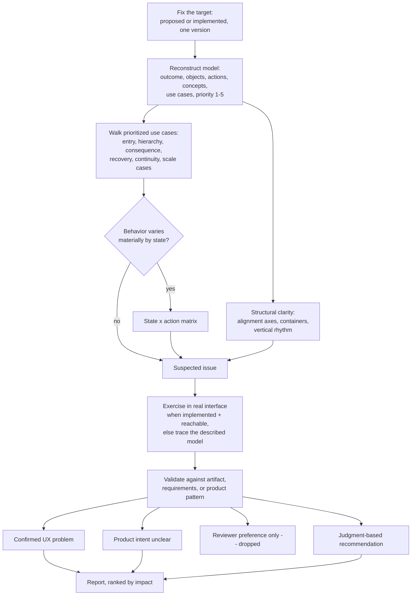

## Overview

An experience can look reasonable and still fail the people using it: a
priority action buried behind a rarely used one, a state with no way back,
a decision made without the information it needs, or a layout whose extra
containers and uneven spacing quietly work against the hierarchy it's
supposed to show. This skill is a fixed procedure for reviewing one
proposed or implemented experience — a mockup, a written interaction
plan/spec, or a built screen/flow, on any platform or technology — against
its own product model rather than against visual preference or a specific
build's rendering and platform mechanics. It reconstructs Outcome →
Objects → Actions → Concepts → Use cases → Priority (1–5) → States
from evidence first — the same order used to design the surface — then
walks those use cases. It does not start from whether a screenshot looks
good. Then it checks whether the experience makes those use cases
understandable, executable, consistent, and recoverable, and whether its
structure (alignment, containers, rhythm) reinforces that model instead of
just decorating it. **Less is more:** actively look for controls,
containers, borders, visual levels, words, or decorative elements that
could be removed, combined, or hidden behind progressive disclosure
without losing anything the use case needs. It exercises the real
interface when the target is implemented and tooling permits, but a
proposed experience with no running interface yet is still a valid
target. It reviews and reports; it does not modify the reviewed
implementation.

## When to use

- A proposed experience (mockup, wireframe, written plan/spec) or an
  implemented one (a specific build, screen, or flow, on any platform)
  needs a UX pass on whether its prioritized use cases work against the
  product's own model — distinct from whether a build renders, performs,
  or complies with platform mechanics.
- Hierarchy, grouping, progressive disclosure, recovery paths, and
  continuity need checking against the experience's own stated or evident
  priorities — not a generic best-practices checklist or a visual-style
  opinion.
- A screen or plan's structure (alignment axes, containers, spacing,
  rhythm) needs checking for whether it supports the intended hierarchy
  and grouping, distinct from matching a particular visual style.

## Do not use when

- The request is only about visual style, taste, or aesthetic preference
  with no interaction-model or product-consistency question attached.
- The ask is to also fix or redesign what's found — finish the review
  first; apply changes only as a separate, explicitly authorized step.
- The primary concern is platform/technical build-quality mechanics —
  rendered accessibility-tree behavior, DOM/CSS, design-system token
  conformance, WCAG numeric criteria, API/permission-boundary verification,
  or a named platform's interface-convention guidelines — even when the
  target is an implemented screen. That's a build-quality audit, not this
  skill.
- The ask is a general source-diff or code-quality review (correctness,
  reuse, maintainability) with no UX or product-model question in scope.

## Prerequisites and inputs

- The artifact under review, fixed to one version: a mockup/wireframe
  image, written plan/spec text, or an implemented build/route/screen with
  its environment and version stated.
- Whatever establishes the product model — existing product requirements,
  prior UX planning output, or observable behavior elsewhere in the
  product: the outcome, objects, actions, concepts, prioritized use cases,
  and states the artifact is meant to support. This is the primary
  evidence the review runs on; ask for it if it isn't discoverable, since
  reviewing product-model consistency with no model to check against is a
  materially narrower job.
- Access to the real running interface (browser, simulator/emulator,
  device), when the target is implemented and such access exists. It
  raises confidence and is used to exercise prioritized use cases, but
  isn't a hard requirement — a proposed experience with no running
  interface yet is still reviewable by tracing its described model and
  flows.
- Any known invariants: an established pattern elsewhere in the product
  this experience must stay consistent with, a platform/technology
  constraint, or a stated target audience/permission model.

## Procedure

1. **Fix the target.** Resolve and state exactly what's under review — a
   proposed artifact (mockup, wireframe, plan/spec) or an implemented one
   (build/route/screen/flow, environment, version) — before assessing
   anything. Confirm it isn't still being actively changed.
2. **Establish the model from evidence.** Load
   [references/ui-reasoning.md](references/ui-reasoning.md). Identify
   outcome, objects, actions, **concepts**, use cases in capability form,
   relationships, lifecycle states, and priority (1–5). Ground this in
   product requirements, prior UX planning output, or observed product
   behavior — not invented. Where priority isn't evidenced, record it as
   an open question. Do not start from screens, components, or styling.
3. **Walk each prioritized use case.** Load
   [references/verification.md](references/verification.md). For each
   important use case: discover how to begin, primary path obvious,
   relevant context visible, unnecessary decisions removed, feedback,
   recovery, states handled, hierarchy vs declared priority, platform
   familiarity where relevant, accessible, usable with realistic/extreme
   content, adapts to relevant sizes. A beautiful artifact that fails an
   important use case is a failed design.
4. **Check hierarchy against priority.** Does prominence, placement, and
   grouping reflect actual use-case priority and frequency, not just build
   convenience; are related things grouped with consistent terminology; do
   secondary or rare actions use progressive disclosure instead of
   competing permanently with primary work. Check reuse specifically: when
   the artifact introduces a new component, pattern, or concept, verify an
   existing one in the product wouldn't already serve — flag an
   unnecessary new component, pattern, or concept even when it's
   well-designed on its own terms, since duplicating an existing solution
   is itself a finding.
5. **Check consequence, recovery, and continuity.** Load
   [references/states.md](references/states.md) and
   [references/motion-feedback.md](references/motion-feedback.md).
   Distinct empty vs filtered-empty vs error vs permission; work
   preserved; feedback scaled to consequence; undo/retry rather than
   confirmation theater. Do 0/1/some/many; recognition over recall.
6. **Build a state × action matrix where useful** and run the
   object/action coverage audit in
   [references/verification.md](references/verification.md). Skip the
   matrix only when it would add no signal.
7. **Check structural clarity.** Load
   [references/structure-hierarchy.md](references/structure-hierarchy.md).
   Alignment audit, vertical rhythm, Gestalt grouping, attention budget.
   Grayscale and skeleton reviews: if structure fails without decoration,
   that is a finding about structure — not taste. Judge only whether
   structure supports hierarchy, grouping, scanning, or consistency.
   Extra grouping/context sub-checks live in
   [references/review-checklist.md](references/review-checklist.md) if
   either point is in question.
8. **Exercise the real interface when reachable.** For an implemented
   target with available tooling, actually walk the prioritized use cases:
   enter → orient → act → understand result → recover. For a proposed
   target, trace the same sequence through the described model and flows
   instead, and note that this is a lower-confidence walkthrough than an
   exercised one.
9. **Validate every suspected issue.** Before it counts as a finding, check
   it against the actual artifact/interface, the product requirements or
   prior planning output, or an established pattern elsewhere in the
   product. Do not manufacture a product priority in order to create a
   finding, and do not treat a personal stylistic preference as a defect.
10. **Classify and rank.** Split into confirmed UX problems, questions
    about product intent, and judgment-based recommendations (see
    [Output](#output)); prioritize by real impact on the prioritized use
    cases, and consolidate duplicates.



## Output

Return findings grouped in this order, each group visibly separate:

1. **Confirmed UX problems** — validated against behavior, requirements,
   an inconsistency with established product patterns, an inaccessible
   state or action, or another concrete failure — most-impactful first.
2. **Questions about product intent** — cases where a use case's priority,
   an intended behavior, or a design decision can't be confirmed from
   available evidence because product intent itself is unclear; this skill
   does not resolve these, only surfaces them precisely.
3. **Judgment-based recommendations** — real, evidence-backed improvements
   with explicit reasoning, kept distinct from both of the above and never
   a bare statement of preference.

Each finding includes:

- **Location** — the exact use case, screen/state, or plan section
- **Failure scenario** — the concrete interaction, state, or condition that
  surfaces it
- **Impact** — on the specific prioritized use case, not just on appearance
- **Evidence** — what was actually observed (interface walkthrough, matrix
  entry, quoted plan text) or, for structural findings, the principle
  (hierarchy, grouping, scanning, consistency) the current structure
  conflicts with
- **Suggested correction** — the smallest supported fix or decision,
  described only; this skill does not apply it
- **Confidence/condition** — when an assumption remains, or when the
  finding rests on a traced (not exercised) walkthrough

State explicitly which prioritized use cases, states, and structural checks
were actually covered, and which were not — including whether the real
interface was reachable — rather than leaving coverage implicit.

Write each finding in plain, concrete English — the shortest phrasing
that still tells the reader what they need to act.

## Verification

Before handing back findings, check:

- The target (proposed artifact or implemented build/version) was fixed
  and stated, not left implicit.
- Actors, objects, **concepts**, actions, prioritized use cases,
  relationships, and lifecycle states were established from evidence
  before any finding was made, not assumed to justify one.
- Each prioritized use case was walked with the questions in
  [references/verification.md](references/verification.md) — not judged
  from whether a screenshot looked good.
- Hierarchy/prominence was checked against actual use-case priority, not
  assumed correct because the screen looks complete.
- Consequence, reversibility, recovery, continuity, and 0/1/some/many cases
  were each considered for use cases where they plausibly apply.
- A state × action matrix was used wherever behavior varied materially by
  state, and skipped only where it would add no signal.
- Structural clarity (alignment axes, containers, vertical rhythm) was
  judged only against hierarchy/grouping/scanning/consistency — never
  against pixel sameness or reviewer taste. Grayscale and skeleton
  reviews were used where hierarchy or grouping was in question.
- The real interface was exercised when the target was implemented and
  tooling permitted; where it wasn't reachable, that gap is stated, not
  silently treated as equivalent to a traced walkthrough.
- Every confirmed UX problem was validated against the artifact/interface,
  product requirements, or an established product pattern.
- Confirmed UX problems, questions about product intent, and judgment-based
  recommendations stayed in three separate, unflattened groups.
- No finding rests on a manufactured product priority or the reviewer's own
  visual taste.
- Nothing in the reviewed implementation was modified during the review.

## Boundaries

This is a Review-step skill: it reviews and reports, and does not modify
the implementation or artifact under review or apply any of its own
suggested corrections, unless a human or the invoking task explicitly
authorizes a separate step. Product-model and interaction-quality
consistency takes precedence over local novelty — a change that looks
fresher but breaks an established use-case priority, grouping, or recovery
path is a problem, not an improvement. This skill does not adjudicate open
questions about product intent; it surfaces them precisely and leaves the
decision to whoever owns product direction. It stays out of platform/
technical build-quality mechanics (see [Do not use when](#do-not-use-when))
even on an implemented screen. Protect secrets and sensitive material
encountered while reviewing — reference their location rather than
reproducing them in findings.

## Failure behavior

- No fixed target, or the target keeps changing while under review → stop
  and ask rather than reviewing a moving target.
- No product requirements, prior UX planning output, or observable existing
  behavior available to establish the model → say so as a coverage gap and
  ask what the experience is supposed to accomplish, rather than inventing
  actors, objects, or priorities to review against.
- The target is implemented but the real interface isn't reachable (no
  browser/simulator/device access) → state that the walkthrough was traced
  through the artifact/description instead of exercised, as a named,
  lower-confidence gap, not silently treated as equivalent evidence.
- A suspected issue can't be validated with available evidence → report it
  as a question about product intent, not a confirmed UX problem.
- A suspected issue turns out to rest only on the reviewer's own visual
  taste with no tie to hierarchy, grouping, scanning, consistency, or a
  concrete use-case failure → drop it, or move it to recommendations with
  that caveat; never report it as a confirmed problem.
- Secrets or sensitive material are encountered while reviewing → don't
  reproduce them in the findings output; reference their location only.

## Examples

```
Here's a wireframe for a new "project archive" flow (attached). Review it
for UX problems before we build it.
```

Expected approach: fix the wireframe as the target; establish the model
from it and from how "project" is already handled elsewhere in the
product; walk the prioritized use case (archive without losing access to
data) for entry, consequence, and reversibility; since nothing is built
yet, trace the walkthrough through the wireframe instead of exercising a
real interface, and note that explicitly; separate a confirmed problem (no
restore action shown) from a question (is archiving reversible for every
role? — unclear from the wireframe).

When the target is an implemented, running build rather than a proposed
artifact, see
[references/worked-examples.md](references/worked-examples.md) for a
full walkthrough including a state × action matrix.
