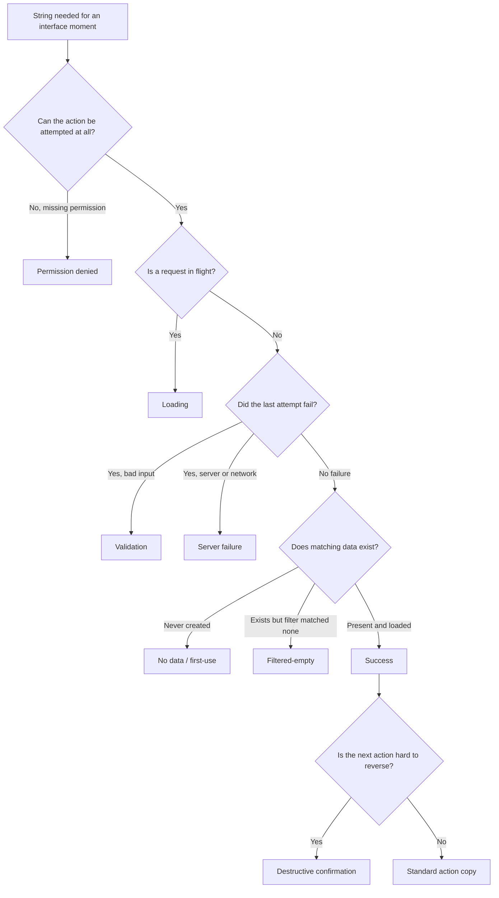

## Overview

This skill writes copy for one specific, already-decided interface moment
— a state, action, error, confirmation, or recovery path — not whole
flows or products, and not the decision about what the interface should
do. It produces copy grounded in what the interface actually does at that
moment, not invented behavior: the copy is only as specific as what the
implementation can actually establish, and it always points to a real next
action.

## When to use

- Writing or rewriting a loading, success, or validation message.
- Writing an error string, including a server-failure or permission-denied
  message.
- Writing an empty state (first-use or filtered-empty) or a
  destructive-action confirmation dialog.
- Writing a retry or recovery message for a failed action.

Don't use this for marketing or landing-page copy, naming a feature or
product, copy for a state that hasn't been implemented or decided yet
(resolve that first), or translating existing copy into another language.

## Prerequisites

- Access to the actual screen(s)/component(s) involved, or their spec, and
  the real state transitions and permission logic behind them.
- The product's existing terminology and action-label conventions (a style
  guide, existing strings, or the surrounding UI) to stay consistent with.

## Inputs

For each string, gather:

- Its exact location and trigger (what causes it to show).
- What the system actually knows at that moment, versus what it might be
  tempting to imply.
- The next real action available to the user from that point.
- Any variables or placeholders it must carry.
- Layout or character constraints, and whether it's persistent or
  temporary.

## Procedure

1. Inspect the real screen(s), state transitions, and permission logic
   before writing any string — never write from the state's name alone.
2. Classify the string against the state taxonomy below. If the
   implementation genuinely can't distinguish the state being asked for
   from another (e.g. "no data" and "server failure" look identical to the
   code), stop and flag that as a missing product state instead of
   inventing a more specific message.
3. Check existing product terminology and reuse the exact action words
   already in use. Treat remove, delete, cancel, discard, retry, publish,
   and revoke as materially different actions, not synonyms.
4. Draft copy that states only what the system actually knows, gives a
   real recovery or next action, and preserves user-entered data where the
   interface allows. Never apologize for a cause the system can't
   establish, and never promise a retry that doesn't exist. Use plain,
   respectful language and match tone to the stakes of the action — a
   flippant or jokey tone has no place in a data-loss or account-impact
   confirmation. Keep any technical diagnostics (error codes, stack
   traces, internal identifiers) out of the user-facing string, or
   translate them into terms the audience can act on; log or expose raw
   detail elsewhere for support/debugging, not in the copy itself.
5. For a consequential or hard-to-reverse action, name the target and the
   consequence explicitly, and put the action's own name — not a generic
   "OK" or "Confirm" — on the confirming button.
6. Apply the accessibility and localization checks below before
   finalizing.
7. Load [references/slop.md](references/slop.md) and fail the pass if
   drafted strings still contain `—`, synonym triplets, or extra CTAs
   the interface does not actually offer.

### State taxonomy

- **Loading** — explain only if useful; never claim success before it's
  known.
- **Success** — confirm the meaningful result without burying the next
  task.
- **Validation** — state the actual requirement near the field; preserve
  valid input already entered.
- **Server failure** — state what could not complete and a safe next
  action; never claim nothing changed when the outcome is actually
  uncertain; keep the message in plain language and leave raw error
  codes/stack traces out of it, even when they're available.
- **Permission denied** — offer only a recovery/access route that's real
  (e.g. "request access" only if that flow exists).
- **No data / first-use** — orient the user to first use and any
  supported setup step; distinct from an error.
- **Filtered-empty** — distinct from "no data": offer a way to reset or
  adjust the active filter/search.
- **Destructive confirmation** — name the action, the target, and the
  consequence; put the action's own name on the confirming button.



If none of these branches cleanly fits the real behavior you inspect,
that's the signal to flag a missing or indistinguishable product state
rather than force the string into the nearest label.

### Accessibility and localization

- Keep essential labels visible and real — a placeholder is never a
  substitute for a label.
- Associate validation/error text with its field.
- Expose status changes (loading done, save succeeded, error appeared) to
  assistive technology, not only through icon, color, animation, or
  position.
- Write so meaning survives translation: keep variables and their context
  intact, support plurals, don't assume left-to-right reading order or a
  fixed string length, and account for UI text scaling. This skill doesn't
  produce translated strings — it writes source copy a translator or
  localization step can work with.

## Output

The copy itself: per string, the final text and, where relevant, a short
state/variant table. Place it in context — the component/string file, or a
clearly labeled list mapped to state and location. Include a short note of
which states were inspected directly, which were inferred, and which were
flagged as indistinguishable.

## Verification

- Read the copy in its real layout at realistic widths/lengths, not just
  as isolated text.
- Re-check each string against what the system actually knows at that
  trigger point.
- Confirm labels are real labels (not placeholder-only) and errors are
  associated with their field.
- Confirm status changes are exposed to assistive technology and not
  signaled by icon/color/position alone.
- Confirm tone is plain and respectful and scaled to the action's stakes,
  and that no raw technical diagnostics (error codes, stack traces,
  internal identifiers) leaked into user-facing text.
- [references/slop.md](references/slop.md): no em dashes, no synonym
  triplets, no list that could have been a sentence with one next action.
- Report which states were inspected, which were inferred, and which
  weren't checked — separately, not blended into one "done" claim.

## Boundaries

This skill writes copy only. It does not change component behavior,
application logic, permissions, or add new product states. It does not
produce translations — it flags what localization needs (variables,
plurals, text direction, length growth) for a separate localization step.
No commits, PRs, or other external writes are implied by this skill.

## Failure behavior

If the real screens, state transitions, or permission logic aren't
inspectable, stop and report that as a blocker rather than writing copy
from the state name alone. If a requested state can't actually be
distinguished by the implementation from another state, say so explicitly
and propose the nearest state the implementation can support, rather than
inventing more specific copy. If existing terminology conflicts with what
was requested, surface the conflict instead of silently picking one.

## Examples

```
Write the error copy for a failed file upload. The API can return a
size-limit error, a network error, or a generic server error.
```

Expected approach: inspect the actual error the API returns for each
case rather than assuming one generic message; write copy for what could
not complete plus the real retry or next action for each case; if the UI
currently can't tell two of these causes apart, flag that instead of
inventing distinct messages for causes the code can't actually
distinguish.

```
Write the confirmation dialog for "Delete project."
```

Expected approach: check the actual behavior to confirm whether deletion
is recoverable (e.g. a trash/undo window) or permanent; name the project
and the real consequence in the dialog body; put "Delete project" — not
"OK" or "Confirm" — on the confirming button.
