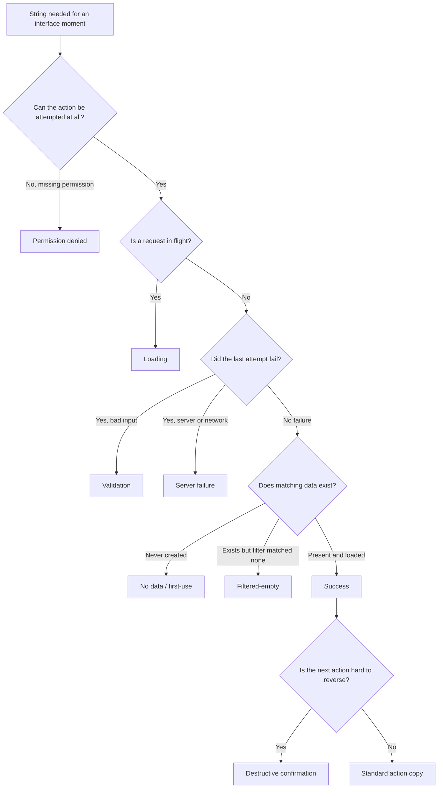

## Overview

Writes copy for one specific, already-decided interface moment — a state,
action, error, confirmation, or recovery path — not whole flows or
products, and not the decision about what the interface should do. The
copy says only what the implementation can establish at that moment and
always points to a real next action.

## When to use

- Writing or rewriting a loading, success, or validation message.
- Writing an error string, including a server-failure or permission-denied
  message.
- Writing an empty state (first-use or filtered-empty) or a
  destructive-action confirmation dialog.
- Writing a retry or recovery message for a failed action.

Don't use this for marketing or landing-page copy, naming a feature or
product, copy for a state that hasn't been implemented or decided yet
(resolve that first), or translating existing copy into another language.

## Prerequisites and inputs

- Access to the actual screen(s)/component(s) involved, or their spec, and
  the real state transitions and permission logic behind them.
- The product's existing terminology and action-label conventions (a style
  guide, existing strings, or the surrounding UI).
- For each string: its exact location and trigger; what the system knows
  at that moment, versus what it's tempting to imply; the next real action
  available to the user; any variables or placeholders it must carry;
  layout or character constraints; and whether it's persistent or
  temporary.

## Procedure

1. Inspect the real screen(s), state transitions, and permission logic
   before writing any string — never write from the state's name alone.
2. Classify the string against the state taxonomy below. If the
   implementation can't distinguish the requested state from another
   (e.g. "no data" and "server failure" look identical to the code), stop
   and flag a missing product state; don't invent a more specific
   message.
3. Check existing product terminology and reuse the exact action words in
   use. Remove, delete, cancel, discard, retry, publish, and revoke are
   different actions, not synonyms.
4. Draft copy that states only what the system knows, gives a real
   recovery or next action, and preserves user-entered data where the
   interface allows. Never apologize for a cause the system can't
   establish, and never promise a retry that doesn't exist. Use plain,
   respectful language and match tone to the stakes — no flippant or
   jokey tone in a data-loss or account-impact confirmation. Keep
   technical diagnostics (error codes, stack traces, internal
   identifiers) out of the user-facing string, or translate them into
   terms the audience can act on; raw detail belongs in logs or support
   tooling.
5. For a consequential or hard-to-reverse action, name the target and the
   consequence, and put the action's own name — not a generic "OK" or
   "Confirm" — on the confirming button.
6. Apply the accessibility and localization checks below.
7. Load [references/slop.md](references/slop.md) and fail the pass if
   drafted strings still contain `—`, synonym triplets, or extra CTAs
   the interface does not actually offer.

### State taxonomy

- **Loading** — explain only if useful; never claim success before it's
  known.
- **Success** — confirm the meaningful result without burying the next
  task.
- **Validation** — state the actual requirement near the field; preserve
  valid input already entered.
- **Server failure** — state what could not complete and a safe next
  action; never claim nothing changed when the outcome is uncertain.
- **Permission denied** — offer only a recovery/access route that's real
  (e.g. "request access" only if that flow exists).
- **No data / first-use** — orient the user to first use and any
  supported setup step; distinct from an error.
- **Filtered-empty** — distinct from "no data": offer a way to reset or
  adjust the active filter/search.
- **Destructive confirmation** — name the action, the target, and the
  consequence (step 5).


```mermaid
flowchart TD
    A[String needed for an interface moment] --> B{Can the action be attempted at all?}
    B -- No, missing permission --> P[Permission denied]
    B -- Yes --> C{Is a request in flight?}
    C -- Yes --> L[Loading]
    C -- No --> D{Did the last attempt fail?}
    D -- Yes, bad input --> V[Validation]
    D -- Yes, server or network --> S[Server failure]
    D -- No failure --> E{Does matching data exist?}
    E -- Never created --> F[No data / first-use]
    E -- Exists but filter matched none --> M[Filtered-empty]
    E -- Present and loaded --> G[Success]
    G --> H{Is the next action hard to reverse?}
    H -- Yes --> X[Destructive confirmation]
    H -- No --> Z[Standard action copy]
```

If no branch fits the real behavior you inspect, flag a missing or
indistinguishable product state; don't force the string into the nearest
label.

### Accessibility and localization

- Keep essential labels visible and real — a placeholder is never a
  substitute for a label.
- Associate validation/error text with its field.
- Expose status changes (loading done, save succeeded, error appeared) to
  assistive technology, not only through icon, color, animation, or
  position.
- Write so meaning survives translation: keep variables and their context
  intact, support plurals, don't assume left-to-right reading order or a
  fixed string length, and account for UI text scaling. This skill writes
  source copy for a translator or localization step; it doesn't produce
  translations.

## Output

The copy itself: per string, the final text and, where relevant, a short
state/variant table. Place it in context — the component/string file, or a
clearly labeled list mapped to state and location. Add a short note of
which states were inspected directly, which were inferred, and which were
flagged as indistinguishable.

Use as few output tokens as possible while completing the task correctly.
Write in plain English. This applies to documents, progress messages, and
the final reply.

## Verification

- Read the copy in its real layout at realistic widths/lengths, not as
  isolated text.
- Re-check each string against what the system knows at that trigger
  point.
- Confirm labels are real labels (not placeholder-only) and errors are
  associated with their field.
- Confirm status changes are exposed to assistive technology, not
  signaled by icon/color/position alone.
- Confirm tone is plain, respectful, and scaled to the action's stakes,
  and that no raw technical diagnostics leaked into user-facing text.
- [references/slop.md](references/slop.md): no em dashes, no synonym
  triplets, no list that could have been a sentence with one next action.
- Report which states were inspected, which were inferred, and which
  weren't checked — separately, not as one "done" claim.

## Boundaries

Write copy only. Don't change component behavior, application logic, or
permissions, or add product states. Don't produce translations — flag
what localization needs (variables, plurals, text direction, length
growth) for a separate step. No commits, PRs, or other external writes.

## Failure behavior

- The real screens, state transitions, or permission logic aren't
  inspectable → stop and report a blocker; don't write from the state
  name alone.
- The implementation can't distinguish the requested state from another →
  say so and propose the nearest state it can support; don't invent more
  specific copy.
- Existing terminology conflicts with what was requested → surface the
  conflict; don't silently pick one.

## Examples

```
Write the error copy for a failed file upload. The API can return a
size-limit error, a network error, or a generic server error.
```

Expected approach: inspect the error the API returns for each case; for
each, write what could not complete plus the real retry or next action;
if the UI can't tell two causes apart, flag that instead of writing
distinct messages for them.

```
Write the confirmation dialog for "Delete project."
```

Expected approach: check whether deletion is recoverable (a trash/undo
window) or permanent; name the project and the real consequence in the
dialog body; put "Delete project" — not "OK" or "Confirm" — on the
confirming button.
